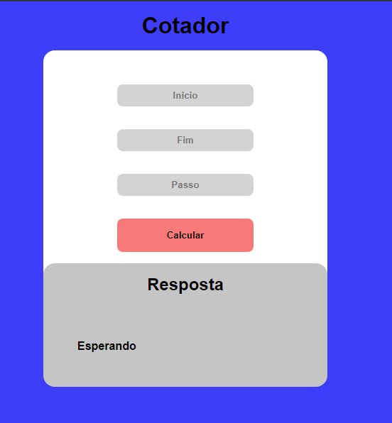
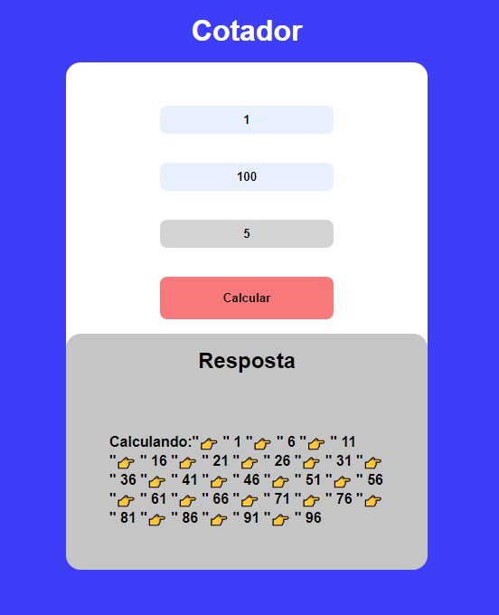

# Explicação 

Nesse repositorio temos um contador que pede um numero inicial, um numero final e de quanto em quanto. Logo após vai printar cada numero de acordo com a quantidade indicada pelo usuario.

# Tecnologias utilizadas

 
 
  
  
 
  

 
 
 

  
  

Na segunda imagem temos o valor partindo de 1 até 100 de 5 em 5.

